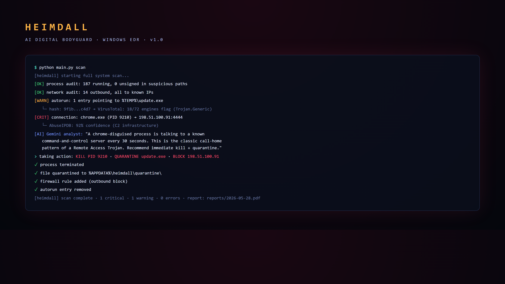
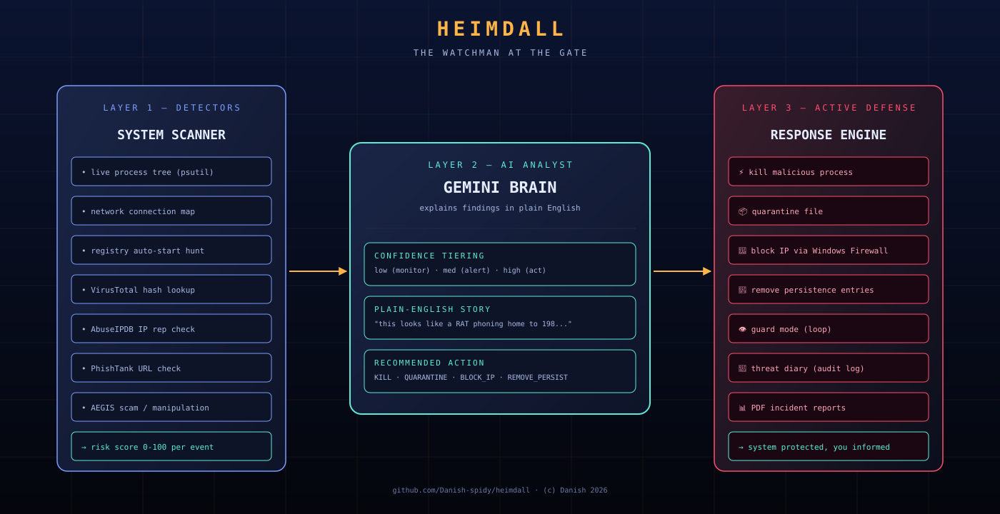

# 🛡️ HEIMDALL

### AI Digital Bodyguard — Windows EDR in Python

> *The watchman that guards your system's gate.*

-orange?style=flat-square)

**Behaviour-based detection · Active Defense · AI plain-English analyst**

---

> ## 🔒 Source code is private
>
> Recruiters / hiring managers: ping me for read-only access.

---

## What is HEIMDALL

HEIMDALL is a system-level **Windows security agent** written in Python. It hunts for Remote Access Trojans (RATs), malware and attacker activity on a PC — then uses AI to explain what it found in plain English.

It is an **EDR-style** tool (Endpoint Detection & Response): it inspects the OS *from the inside* — live processes, network connections, persistence locations — the same way professional security software does.

## Demo

(Video URL inserted after drag-drop upload.)

## Architecture

## Features

- 🔍 **Full System Scan (RAT Hunt)** — inspects every running process, network connection, auto-start location
- 🎣 **Phishing Link Checker** — any URL gets a verdict + reason
- 🦠 **Malware File Scanner** — files / folders against VirusTotal
- 🌐 **IP Reputation Check** — across 3 intel sources (AbuseIPDB, etc.)
- 🛡️ **Active Defense** — *doesn't just detect, it STOPS threats:*
  kills malware processes · quarantines files · blocks IPs in Windows Firewall · removes persistence
- 👁️ **Guard Mode** — continuous scan loop, auto-acts on high-confidence threats
- 🧑‍🛡️ **AEGIS Human Shield** — scans messages for scams / manipulation
- 🧠 **AI Analyst** — Gemini explains every finding in plain English

## Role in the defense stack

| Layer | Tool | What it protects |
|-------|------|-------------------|
| PC | **HEIMDALL** | files, processes, system |
| Human | **AEGIS** (module 3 of HEIMDALL) | messages, scams, manipulation |
| Network | **SENTRY** | packets, attacks, traffic |

HEIMDALL is the foundation of the stack. The other two extend it outward.

## Why it matters

Antivirus is reactive — it checks files against a known list, so new threats slip through. HEIMDALL is **behaviour-based**: it watches what programs *do*, not what they're called, so it catches brand-new threats too.

## Contact

For source-code access, reach out via my GitHub profile.

## Licence

(c) 2026 Danish · All rights reserved. Proprietary.
